  

 

### `$ cat sobre-mi.md`

Estudiante de último curso de **Ingeniería Informática** en la UCAM (Murcia), con dos años previos en Ingeniería Telemática.
Tengo base sólida en **Java, bases de datos y desarrollo web**, y he trabajado en equipo en proyectos de
sistemas distribuidos, aplicaciones web y computación paralela.

Actualmente me formo en desarrollo asistido por IA y en ciberseguridad práctica con Hack4u.
Busco **prácticas en el sector tecnológico**.

### `$ ls stack/`

**Lenguajes**

       

**Web**

     

**Bases de datos y sistemas**

   

**Computación paralela**

 

**Herramientas**

  

### `$ ls certs/`

| Certificación | Emisor |
|---|---|
| Java SE 7 Programmer (Associate) | Oracle |
| Data Modeling and Relational Database Design | Oracle |
| Linux Essentials | NDG / LPI |
| MTA: Software Development Fundamentals | Microsoft |

**Idiomas:** español (nativo), inglés B2 (certificación en preparación).

### `$ ls proyectos/`

> Los proyectos están fijados más abajo en este perfil. Iré subiendo los nuevos a medida que los termine.

### `$ ./contacto`

