  

## 📌 Proyectos destacados

| Proyecto | Descripción | Tecnologías |
|---|---|---|
| [Nombre del proyecto](https://github.com/TU_USUARIO/repo) | Qué hace, en una línea | Tecnología 1, 2 |
| [Nombre del proyecto](https://github.com/TU_USUARIO/repo) | Qué hace, en una línea | Tecnología 1, 2 |
| [Nombre del proyecto](https://github.com/TU_USUARIO/repo) | Qué hace, en una línea | Tecnología 1, 2 |

## 📊 Estadísticas

  
  

## 🐍 Contribuciones

<picture>
  <source media="(prefers-color-scheme: dark)" srcset="https://raw.githubusercontent.com/TU_USUARIO/TU_USUARIO/output/github-snake-dark.svg" />
  
</picture>

## 📫 Contacto

